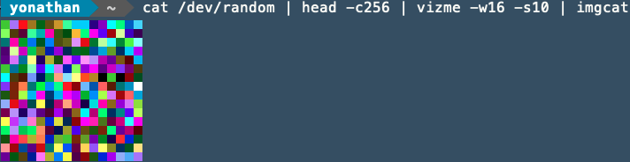
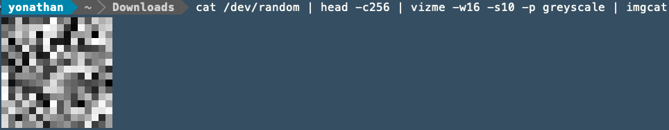

# vizme
A simple python-based command-line utility to to visualize random blobs of data. It is heavily inspired by `pixd` made by `FireFly`: https://github.com/FireyFly/pixd

`vizme` can be used convert a raw data-stream to a visual representation in image format (or terminal viewing in ANSI). 

## Usage
`vizme` is installed as a command-line utility accessible as `vizme` from the command-line. Vizme has a (small) help menu.
For the most part `vizme` expects input data from either a filepath or from /dev/stdin and a way to output it. By default
vizme will output the data in PNG format which can be written to a file.

The help section:
```text
vizme -h
usage: vizme [-h] [-t] [-w WIDTH] [-s SCALE] [-p {pixd,greyscale}]
             [INPUT] [OUTPUT]

positional arguments:
  INPUT                 Data to convert (can be a file, don't specify for
                        stdin)
  OUTPUT                Where to write output to (can be a file, don't specify
                        for stdout)

optional arguments:
  -h, --help            show this help message and exit
  -t, --terminal        Sets output to be terminal (colored) ANSI.
  -w WIDTH, --width WIDTH
                        Output columns width
  -s SCALE, --scale SCALE
                        Scales the output pixels (2 means 2 times the amount
                        of columns/rows for the same data)
  -p {pixd,greyscale}, --palette {pixd,greyscale}
                        Sets the palette to use for output
```

We can take some data from `/dev/random` and pipe it through head to limit it to 256 bytes, set a width of 16 and pipe it to a PNG file:
```text
cat /dev/random | head -c256 | vizme -w16 > image.png
```

Which gives us a really tiny PNG with random data using the default palette.


We can scale it up times 10 to see whats going on:
```text
cat /dev/random | head -c256 | vizme -w16 -s10 > image.png
```

Which gives us a bigger image:


`vizme` also has a terminal output option which outputs ANSI full-block characters with the same color output.

## Examples

This is the very bare-basic of what you can do with `vizme`. While it doesn't have implementations for image manipulation
or some specific data cutting from what it reads/writes you can do this yourself on the command-line quite easily.
If you still want to see a feature in `vizme` feel free to raise tickets / pull requests.

### Converting output

Converting the PNG output to JPG (or any image format) which requires imagemagick:

```text
cat /dev/random | head -c256 | vizme -w16 -s10 | convert /dev/stdin my_image.jpg
```

### Preview output image in terminal 

Previewing your output image in your terminal, required imgcat shell extension:
```text
cat /dev/random | head -c256 | vizme -w16 -s10 | imgcat
```



### Greyscale output through palette changing

`vizme` comes with two palettes by default. Standard output uses the `pixd` palette and also contains a greyscale:
```text
cat /dev/random | head -c256 | vizme -w16 -s10 -p greyscale | imgcat
```



## Bugs
Feel free to report issues, this 'utility' was build out of ease as I needed something to visualize a data format I was trying to figure out.